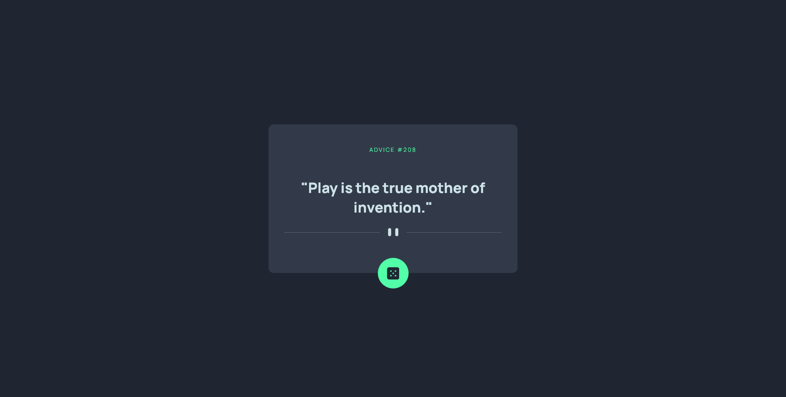

# Frontend Mentor - Advice generator app solution

This is my solution to the [Advice generator app challenge on Frontend Mentor](https://www.frontendmentor.io/challenges/advice-generator-app-QdUG-13db).

## Table of contents

- [Frontend Mentor - Advice generator app solution](#frontend-mentor---advice-generator-app-solution)
  - [Table of contents](#table-of-contents)
  - [Overview](#overview)
    - [The challenge](#the-challenge)
    - [Screenshot](#screenshot)
    - [Links](#links)
  - [My process](#my-process)
    - [Built with](#built-with)
    - [What I learned](#what-i-learned)
    - [Continued development](#continued-development)
  - [Author](#author)

## Overview

### The challenge

Users should be able to:

- View the optimal layout for the app depending on their device's screen size
- See hover states for all interactive elements on the page
- Generate a new piece of advice by clicking the dice icon

### Screenshot



### Links

- Solution URL: [](https://www.frontendmentor.io/profile/juliflorezg)
- Live Site URL: (https://advice-generator-edc15.web.app/)

## My process

- I created this project using the create-react-app tool for creating the overall react app, I built components for the Advice card, the svg button, and the spinner that appears when loading the advice . I used the Advice Slip JSON API for getting the advice data for the components. For styling I used a mix of global css with base styles and Styled Components for the components.

### Built with

- Flexbox
- Styled Components for the components' CSS
- Mobile-first workflow
- [React](https://reactjs.org/) - JS library
- React hooks
- Advice Slip JSON API

### What I learned

I used Styled Components for CSS.

Using styled components we can have the styling inside the js file, which can be good for some, and managing the media queries and other features such as keyframes is really straight forward. Something that I need to apply a bit more is passing props to the component and managing the styles based on that.

```js

const DiceContainer = styled.div`
  position: absolute;
  display: flex;
  justify-content: center;
  align-items: center;
  width: 60px;
  height: 60px;
  bottom: -30px;
  left: 50%;
  transform: translateX(-50%);
  background-color: hsl(150, 100%, 66%);
  border-radius: 50%;
  cursor: pointer;
  transition: box-shadow 0.2s ease;
  animation: fade-in 400ms linear;

  @keyframes fade-in {
    0% {
      opacity: 0;
      transform: translate(-50%, 20px);
    }
    100% {
      opacity: 1;
      transform: translateY(0);
      transform: translate(-50%, 0);
    }
  }

  &:hover {
    box-shadow: 0 0 30px 5px hsl(150, 100%, 66%);
  }
`
```


I applied react concepts such as props, state as well as using the useEffect hook for getting the advice data and managing the  loading state.

```js
// using useEffect to get the advice data from the API, then passing that data to the child component props.
useEffect(() => {
    setIsLoading(() => true)

    const getAdvice = async () => {
      const randomID = Math.ceil(Math.random() * 220)
      const response = await fetch(
        `https://api.adviceslip.com/advice/${randomID}`
      )
      const data = await response.json()

      if (!data.slip) {
        getAdvice()
      }

      setAdviceId(data.slip.id)
      setAdviceText(data.slip.advice)
      setIsLoading(false)
    }
    
    getAdvice()
  }, [makePetition])
```

### Continued development

- Maybe taking a record of past advices so them don't get lost with each petition and users can navigate to the previous (or some previous advices)

## Author

- Frontend Mentor - [@juliflorezg](https://www.frontendmentor.io/profile/juliflorezg)
- Github - [@juliflorezg](https://github.com/juliflorezg)
